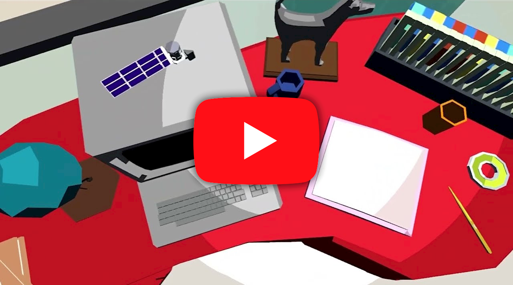

# She can VR (Project Customer)

Science, Technology, Engineering, and Math, the four area’s of STEM. Currently most people working in STEM fields are men, but She can VR exists to show you that women can have an equally big impact on the world of science!

## Trailer

## Soundtrack

Stream or buy the soundtrack of this game at [redotter.bandcamp.com/track/valerie-thomas](https://redotter.bandcamp.com/track/valerie-thomas)

## About this game

### She can VR
This interactive experience aims to teach people about the women that made great leaps forward in science. Explore a small room filled with small items that are connected to the women of STEM, or otherwise to the general time or institution they worked in.

### Valerie Thomas
One of these women who (used to) work in STEM is Valerie Thomas, who worked for NASA around the 1970’s, currently the whole experience is based on her and her work in NASA’s Landsat program or the LACIE project.

## [Click here to download the game!](../../releases/latest)
